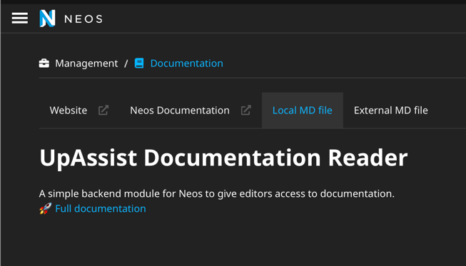

# Documentation Reader for Neos

Enhance your editors experience with a simple documentation reader for Neos!

It's quick to setup, I promise! 😉

+++ Retype example
 
+++ Neos example  
 
+++ Markdown example

+++ Module navigation

+++


## What does it do?

This package gives you a backend module in Neos where you can disclose your documentation for the editors. Additionally, a button
with an external link to the documentation is provided (when not linking to Markdown files directly).

## How to set it up?

1. Add the package to your Sites composer file: `"upassist/documentationreader": "*"` and run `composer update`.
2. Next add the endpoints for your documentation to your website by adding entries to the **documentationEndpoints** setting:
```yaml #4
UpAssist:
  DocumentationReader:
    # The endpoints for your documentation
    documentationEndpoints:
      - label: 'Neos Documentation'
        url: 'https://www.neos.io/docs-and-support/editor-documentation/administration-interface.html'
```
3. Lastly give your editors access to the module via the User Module from Neos, or add the following to a `Policy.yaml`:
```yaml
roles:
  'Neos.Neos:Editor':
    privileges:
      -
        privilegeTarget: 'UpAssist.DocumentationReader:DocumentationModule'
        permission: GRANT
```

## What documentation is supported?
Everything that can be visited online is possible. 

You can use tooling like [Read the Docs](https://readthedocs.org) or 
[Retype](https://retype.com) if you want to provide lots of contents. 

You can also link to standalone, unprocessed markdown files.

Personally I like using [Retype](https://retype.com) which this documentation is using as well. The dark mode default 
fits really nice in Neos too giving your editors a nice integrated feel.

## Using Markdown files
Okay, we got you covered, say it in a small way: you can load a single markdown file. 
Just point the url to the markdown file in your application - or to an external location, for example: `CHANGELOG.md` 
or `https://raw.githubusercontent.com/UpAssist/documentationreader/main/Readme.md`. 

An Eel Helper is used to run the contents of the file through the [Parsedown](https://parsedown.org) library.

### Limitations
- Only one file per tab
- Styling is limited, but you can extend the styling by loading an additional stylesheet to the module and your styles are nested
under `.neos.neos-module .markdown`

## I have found a bug / feature request
Feel free to create an issue a [github](https://github.com/UpAssist/documentationreader/issues).
