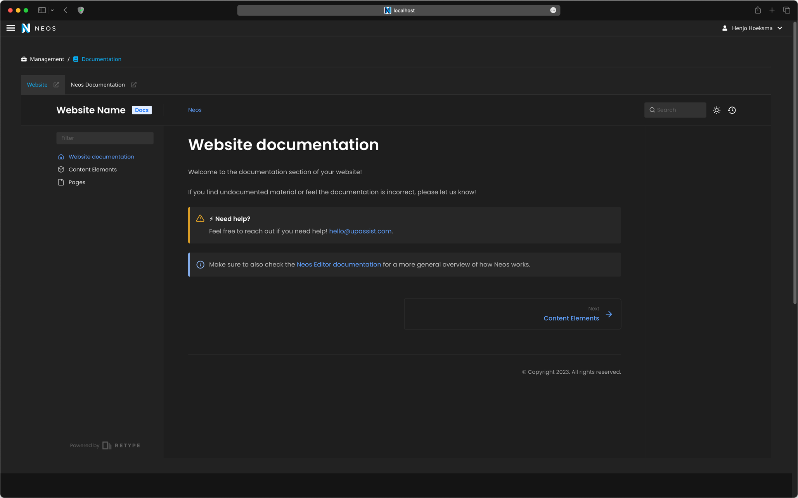
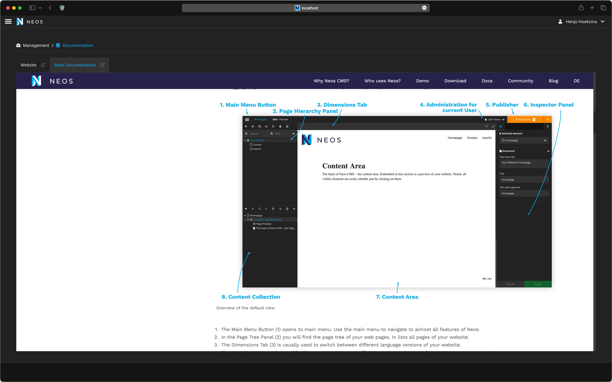
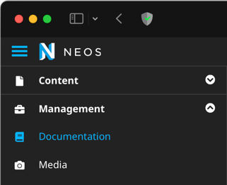

# Documentation Reader for Neos

Enhance your editors experience with a simple documentation reader for Neos!

It's quick to setup, I promise! 😉

+++ Retype example
 
+++ Neos example  
 
+++ Module navigation

+++


## What does it do?

This package gives you a backend module in Neos where you can disclose your documentation for the editors. Additionally, a button
with an external link to the documentation is provided.

## How to set it up?

1. Add the package to your Sites composer file: `"upassist/documentationreader": "*"` and run `composer update`.
2. Next add the endpoints for your documentation to your website by adding entries to the **documentationEndpoints** setting:
```yaml #4
UpAssist:
  DocumentationReader:
    # The endpoints for your documentation
    documentationEndpoints:
      - label: 'Neos Documentation'
        url: 'https://www.neos.io/docs-and-support/editor-documentation/administration-interface.html'
```
3. Lastly give your editors access to the module via the User Module from Neos, or add the following to a `Policy.yaml`:
```yaml
roles:
  'Neos.Neos:Editor':
    privileges:
      -
        privilegeTarget: 'UpAssist.DocumentationReader:DocumentationModule'
        permission: GRANT
```

## What documentation is supported?

Everything that can be visited online is possible to add since it is a simple iframe that loads the page. (Never said it was something fancy 😉).

Personally I like using [Retype](https://retype.com) which this documentation is using as well. The dark mode default fits really nice in Neos too giving 
your editors a nice integrated feel.

## I have found a bug / feature request

Feel free to create an issue a [github](https://github.com/UpAssist/documentationreader/issues).
